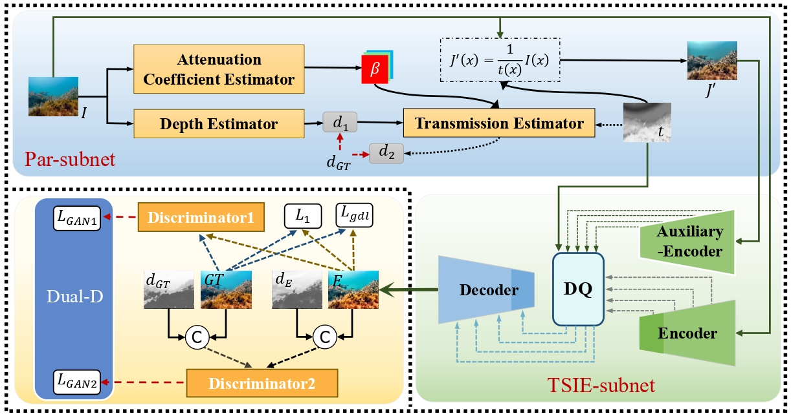
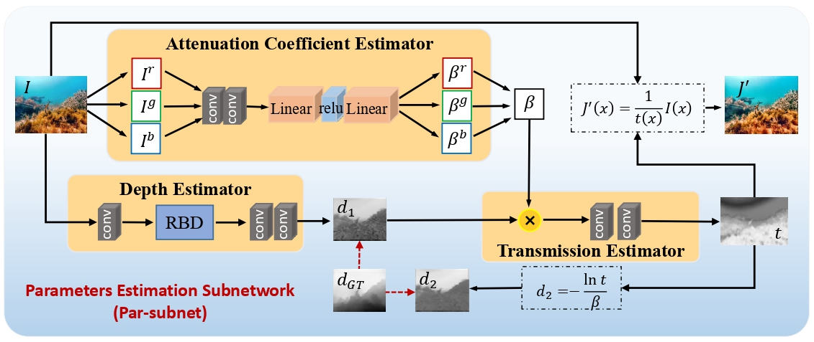
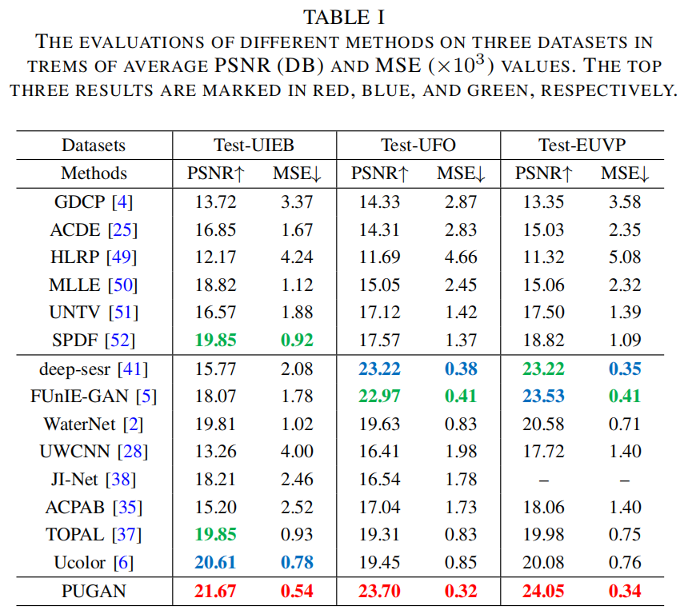

# PUGAN_TIP2023

Runmin Cong, Wenyu Yang, Wei Zhang, Chongyi Li, Chun-Le Guo, Qingming Huang, and Sam Kwong, PUGAN: Physical model-guided underwater image enhancement using GAN with dual-discriminators, IEEE Transactions on Image Processing, vol. 32, pp. 4472-4485, 2023.

## Network

#### Our overall framework:



#### Par-subnet:



#### TSIE-subnet:


#### Requirement:

Pleasure configure the environment according to the given version:

- python 3.6.13
- pytorch 1.8.2+cu111
- torchvision 0.9.2
- pillow 8.4.0
- skimage 0.17.2
- numpy 1.19.5

We also provide ".yaml" files for conda environment configuration, you can download it from [[Link](https://pan.baidu.com/s/1Yayar1TMqjqRlyUrxTfoew?pwd=mvpP)], code: mvpP, then  use `conda env create -f requirement.yaml` to create a required environment.

## Data Preprocessing

 Please follow the tips to download the processed datasets and pre-trained model:

  1. Download training data  from [[Link](https://pan.baidu.com/s/11PGupIgdfN506AYC6jK1ew?pwd=mvpP)], code: mvpP. 
 2. Download testing data from [[Link](https://pan.baidu.com/s/1kNTtddujLjv6KU6BPyUFYA?pwd=mvpP)], code: mvpP.


```python
├── utils
    ├── data_utils.py
├── Par
    ├── model
    ├── model.py
├── nets
    ├── pixpix.py
    ├── fusion.py
    ├── commons.py
├── checkpoints
├── test.py
├── train.py
```


## Training and Testing

**Training command** :
Please unzip the training data set to data\input_train and unzip the corresponding reference of training data set to data\gt_train. 

We provide "train.yaml" files for training a new model from scratch or from a existing model.

```python
python train.py
```

You can also train on a UFO or EVUP dataset by modifying train.yaml. We provide download connections for these datasets : UFO: [[link](https://irvlab.cs.umn.edu/resources/ufo-120-dataset)], EUVP:[[link](http://irvlab.cs.umn.edu/resources/euvp-dataset)]

**Testing command** :
Please unzip the testing data set to tests. 

We provide "test.yaml" files for testing.

The trained model can be download here: [[Link]n(https://pan.baidu.com/s/1y0_kHl1NRjrKc36LEX9wFQ?pwd=mvpP)], code: .mvpP

```python
python test.py
```

## Evaluation

We implement  two metrics: PSNR, MSE.

```python
python evaluations/measure_ssim_psnr.py
```

## Results

1. **Qualitative results**: we provide the saliency maps, you can download them from [[Link](https://pan.baidu.com/s/12hskOHReUg27UbHNlMbh_A?pwd=mvpP)], code: mvpP.
2. **Quantitative results**: 



## Bibtex

```
   @article{crm/tip23/PUGAN,
           author={Cong, Runmin and Yang, Wenyu and Zhang, Wei and Li, chongyi and Guo, Chun-Le and Huang, Qingming and Kwong, Sam },
           journal={IEEE Trans. Image Process. },
           title= {{PUGAN}: Physical model-guided underwater image enhancement using {GAN} with dual-discriminators},
           volume={32},
           pages={4472-4485},
           year={2023}
           }
  
```

## Contact Us

If you have any questions, please contact Runmin Cong at [rmcong@sdu.edu.cn](mailto:rmcong@sdu.edu.cn) or Qi Qin at [wyuyang@bjtu.edu.cn](mailto:wyuyang@bjtu.edu.cn).
